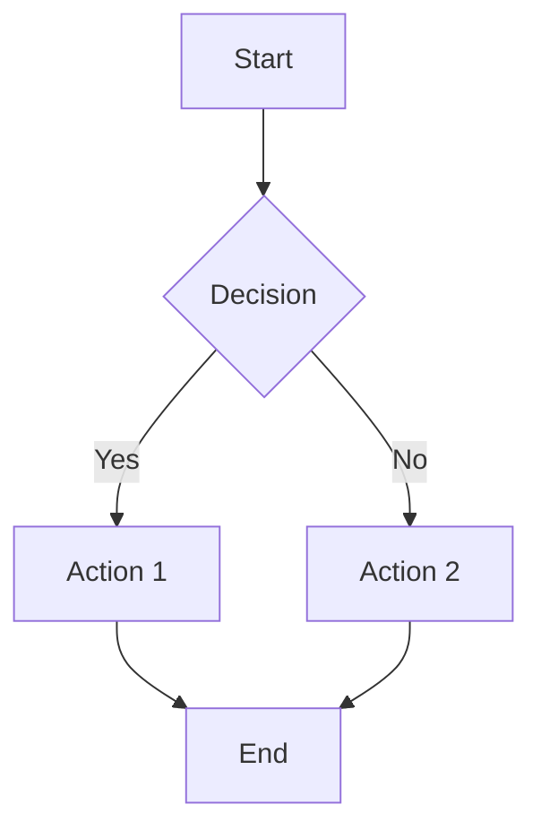

# FlutterLane Example App

> Flutter 桌面端专属、自研 IDE 级分层布局引擎

---

## Features

FlutterLane ships a **MarkdownRenderer** that turns Markdown into native Flutter widgets — perfect for education apps, developer docs, and technical writing.

### What It Renders

| Category | Supported |
|----------|-----------|
| Headings | H1–H6 |
| Inline | **bold**, *italic*, ~~strikethrough~~, `inline code` |
| Code blocks | Fenced with 192 languages |
| Math | Inline `$...$` and display `$$...$$` (KaTeX) |
| Tables | GFM with alignment |
| Callouts | `> [!NOTE]`, `> [!WARNING]`, etc. |
| Mermaid | Diagram placeholders |
| Frontmatter | YAML metadata |
| Lists | Ordered and unordered |
| Links & Images | Inline and reference |
| Blockquotes | Nested supported |
| Horizontal rules | `---` |

---

## Getting Started

```bash
cd example
flutter pub get
flutter run -d macos   # or windows / linux
```

---

## Markdown Features Showcase

Below is every supported Markdown feature rendered live in the example app.

### Headings

```markdown
# Heading 1
## Heading 2
### Heading 3
#### Heading 4
##### Heading 5
###### Heading 6
```

### Inline Formatting

```markdown
This is **bold**, this is *italic*, and this is ~~strikethrough~~.
You can also use `inline code` within a sentence.
```

### Code Blocks with Syntax Highlighting

Fenced code blocks are highlighted using [highlight.dart](https://pub.dev/packages/highlight) with **192 languages**.

````markdown
```dart
void main() {
  print('Hello, FlutterLane!');
}
```
````

```dart
void main() {
  print('Hello, FlutterLane!');
}
```

```python
def fibonacci(n):
    if n <= 1:
        return n
    return fibonacci(n - 1) + fibonacci(n - 2)

for i in range(10):
    print(f"fib({i}) = {fibonacci(i)}")
```

```javascript
const greet = (name) => {
  return `Hello, ${name}!`;
};

console.log(greet("FlutterLane"));
```

### Inline Math

Use single dollar signs for inline LaTeX:

```markdown
The equation $E = mc^2$ shows mass–energy equivalence.
```

The equation $E = mc^2$ shows mass–energy equivalence.

More examples: $x = \frac{-b \pm \sqrt{b^2 - 4ac}}{2a}$ and $\int_0^\infty e^{-x^2} dx = \frac{\sqrt{\pi}}{2}$.

### Display Math

Use double dollar signs for block-level LaTeX:

```markdown
$$
\sum_{i=1}^{n} i = \frac{n(n+1)}{2}
$$
$$
\int_0^1 x^2 \, dx = \frac{1}{3}
$$
$$
\nabla \times \mathbf{E} = -\frac{\partial \mathbf{B}}{\partial t}
$$
$$
\mathbf{A} = \begin{pmatrix} 1 & 2 \\ 3 & 4 \end{pmatrix}
$$
```

### Tables

```markdown
| Feature       | Status | Notes                      |
|---------------|--------|----------------------------|
| Headings      | ✅     | H1–H6                      |
| LaTeX         | ✅     | Inline + display           |
| Code          | ✅     | 192 languages              |
| Callouts      | ✅     | GitHub-style               |
| Mermaid       | 🚧     | Placeholder, upgradeable   |
```

| Feature       | Status | Notes                      |
|---------------|--------|----------------------------|
| Headings      | ✅     | H1–H6                      |
| LaTeX         | ✅     | Inline + display           |
| Code          | ✅     | 192 languages              |
| Callouts      | ✅     | GitHub-style               |
| Mermaid       | 🚧     | Placeholder, upgradeable   |

### Blockquotes

```markdown
> This is a blockquote.
> It can span multiple lines.
>
> > Nested blockquotes are also supported.
```

> This is a blockquote.
> It can span multiple lines.
>
> > Nested blockquotes are also supported.

### Ordered Lists

```markdown
1. First item
2. Second item
3. Third item
   1. Nested ordered
   2. Another nested
```

1. First item
2. Second item
3. Third item
   1. Nested ordered
   2. Another nested

### Unordered Lists

```markdown
- Item A
- Item B
  - Nested item
  - Another nested
- Item C
```

- Item A
- Item B
  - Nested item
  - Another nested
- Item C

### Links

```markdown
[FlutterLane on Gitee](https://gitee.com/flutterlane/flutterlane)
[FlutterLane on GitHub](https://github.com/flutterlane/flutterlane)
```

### Images

```markdown

```

### Horizontal Rules

```markdown
---
```

---

## Callouts

GitHub-style admonitions. Start a blockquote with `[!TYPE]`.

```markdown
> [!NOTE]
> This is an informational callout.

> [!TIP]
> This is a helpful tip.

> [!IMPORTANT]
> This is important information.

> [!WARNING]
> This is a warning.

> [!CAUTION]
> This is a critical warning.
```

> [!NOTE]
> This is an informational callout.

> [!TIP]
> This is a helpful tip.

> [!IMPORTANT]
> This is important information.

> [!WARNING]
> This is a warning.

> [!CAUTION]
> This is a critical warning.

---

## Mermaid Diagrams

Mermaid code blocks are parsed and rendered as a placeholder widget. Upgradeable to `flutter_mermaid` or `merman` (Rust FFI) for live diagrams.

````markdown

````


---

## Frontmatter

YAML frontmatter at the top of a Markdown document is parsed and hidden from the rendered output.

```markdown
---
title: "My Document"
author: "FlutterLane"
tags: [flutter, education, markdown]
---

# Document content starts here
```

---

## Architecture

```
MarkdownRenderer
├── Syntax Extensions
│   ├── FrontmatterSyntax       (YAML frontmatter)
│   ├── MathInlineSyntax        ($...$ LaTeX)
│   ├── MathBlockSyntax         ($$...$$ LaTeX)
│   ├── CalloutSyntax           (> [!TYPE] admonitions)
│   └── MermaidSyntax           (```mermaid blocks)
│
├── Builders
│   ├── CodeBlockBuilder        (flutter_highlight)
│   ├── MathBuilder             (flutter_math_fork)
│   ├── TableBuilder            (GFM tables)
│   └── MermaidBuilder          (diagram placeholder)
│
└── Theme
    └── MarkdownThemeData       (dark + light, 30+ colors)
```

---

## Example App Structure

```
example/lib/
├── main.dart                   # App entry + FlutterLaneChrome shell
├── views/
│   ├── activity_bar.dart       # Left sidebar (activity bar)
│   └── copilot_pane.dart       # AI assistant panel
└── ...
```

---

## Usage in Your App

```dart
import 'package:flutterlane/flutterlane.dart';

// Render Markdown as Flutter widgets
MarkdownRenderer(
  data: '# Hello\n\nThis is **Markdown** rendered as Flutter widgets.',
  theme: MarkdownThemeData.dark(),
  selectable: true,
)

// Or use MarkdownController for programmatic control
final controller = MarkdownController(initialValue: '# Hello');
controller.text = '# Updated';

MarkdownRenderer(controller: controller)
```

---

## Test

```bash
flutter test test/
```

154 tests pass covering extensions, builders, themes, and widget rendering.

---

## License

MIT License
