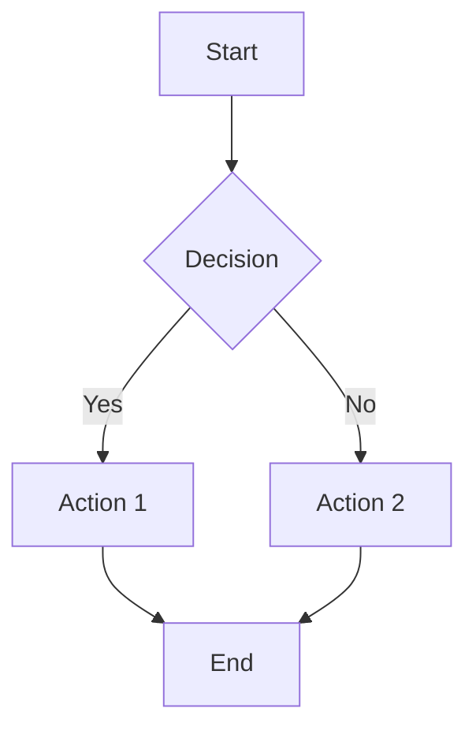

# FlutterLane Markdown Demo

This document demonstrates the full Markdown renderer capabilities built into FlutterLane.

## Headings

# Heading 1
## Heading 2
### Heading 3
#### Heading 4
##### Heading 5
###### Heading 6

## Inline Formatting

This is **bold**, this is *italic*, and this is ~~strikethrough~~.
You can also use `inline code` within a sentence.

## Code Blocks with Syntax Highlighting

Fenced code blocks are highlighted using highlight.dart with 192 languages:

```markdown
```dart
void main() {
  print('Hello, FlutterLane!');
}
```
```

```markdown
```python
def fibonacci(n):
    if n <= 1:
        return n
    return fibonacci(n - 1) + fibonacci(n - 2)

for i in range(10):
    print(f"fib({i}) = {fibonacci(i)}")
```
```

```markdown
```javascript
const greet = (name) => {
  return `Hello, ${name}!`;
};

console.log(greet("FlutterLane"));
```
```

## Inline Math

Use single dollar signs for inline LaTeX:

The equation $E = mc^2$ shows mass–energy equivalence.

More examples: $x = \frac{-b \pm \sqrt{b^2 - 4ac}}{2a}$ and $\int_0^\infty e^{-x^2} dx = \frac{\sqrt{\pi}}{2}$.

## Display Math

Use double dollar signs for block-level LaTeX:

$$
\sum_{i=1}^{n} i = \frac{n(n+1)}{2}
$$

$$
\int_0^1 x^2 \, dx = \frac{1}{3}
$$

$$
\nabla \times \mathbf{E} = -\frac{\partial \mathbf{B}}{\partial t}
$$

$$
\mathbf{A} = \begin{pmatrix} 1 & 2 \\ 3 & 4 \end{pmatrix}
$$

## Tables

| Feature       | Status | Notes                      |
|---------------|--------|----------------------------|
| Headings      | ✅     | H1–H6                      |
| LaTeX         | ✅     | Inline + display           |
| Code          | ✅     | 192 languages              |
| Callouts      | ✅     | GitHub-style               |
| Mermaid       | 🚧     | Placeholder, upgradeable   |

| Feature       | Status | Notes                      |
|---------------|--------|----------------------------|
| Headings      | ✅     | H1–H6                      |
| LaTeX         | ✅     | Inline + display           |
| Code          | ✅     | 192 languages              |
| Callouts      | ✅     | GitHub-style               |
| Mermaid       | 🚧     | Placeholder, upgradeable   |

## Blockquotes

> This is a blockquote.
> It can span multiple lines.
>
> > Nested blockquotes are also supported.

## Ordered Lists

1. First item
2. Second item
3. Third item
   1. Nested ordered
   2. Another nested

## Unordered Lists

- Item A
- Item B
  - Nested item
  - Another nested
- Item C

## Links

[FlutterLane on Gitee](https://gitee.com/flutterlane/flutterlane)
[FlutterLane on GitHub](https://github.com/flutterlane/flutterlane)

## Images


## Horizontal Rules

---

## Callouts

> [!NOTE]
> This is an informational callout.

> [!TIP]
> This is a helpful tip.

> [!IMPORTANT]
> This is important information.

> [!WARNING]
> This is a warning.

> [!CAUTION]
> This is a critical warning.

## Mermaid Diagrams

Mermaid code blocks are parsed as placeholder diagrams:

```markdown

```
